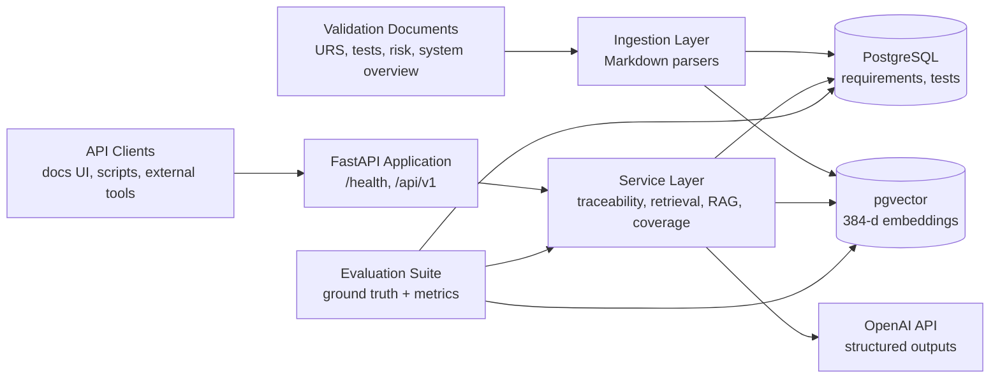
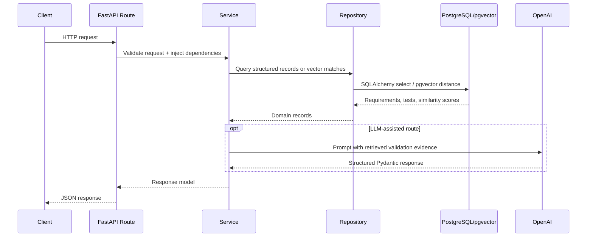
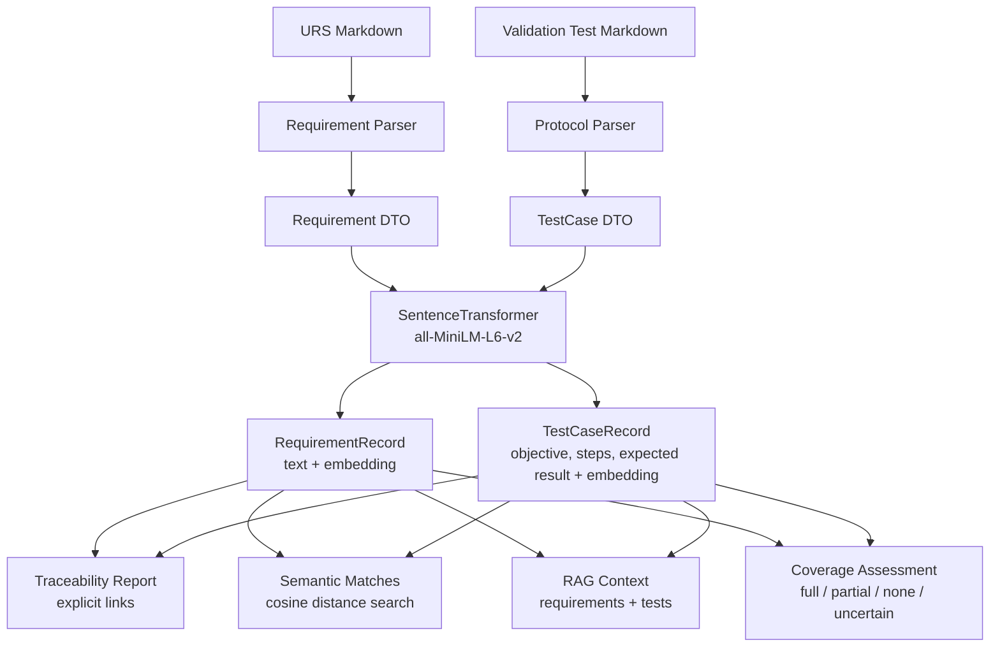
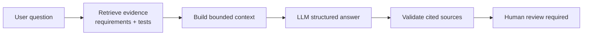
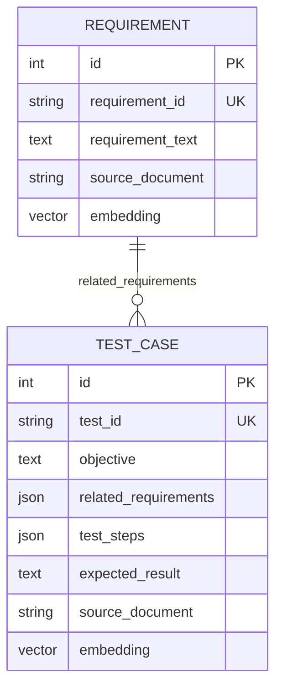
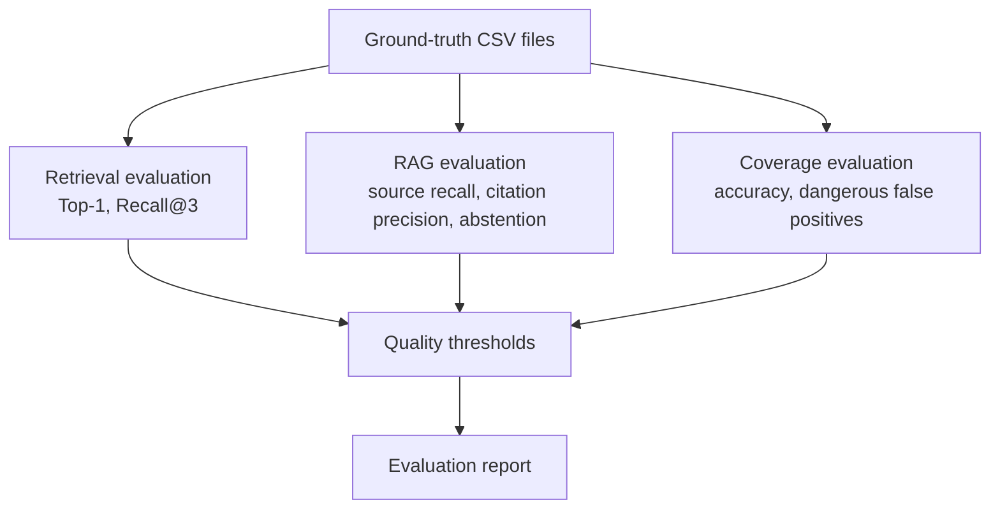

# GxP Validation Copilot

GxP Validation Copilot is a FastAPI backend for analyzing validation coverage in a regulated, GxP-style system. It parses validation documents, stores structured requirements and test cases, builds traceability reports, finds semantically related evidence with vector search, and uses LLM-based review flows with conservative guardrails.

The sample domain is the ABFS-100 Automated Bottle Filling System, a synthetic validation package with user requirements, validation tests, system context, risk notes, and evaluation ground truth.

## Core Capabilities

| Area | What the system does |
| --- | --- |
| Document ingestion | Parses Markdown validation documents into structured requirement and test-case records. |
| Traceability | Maps requirements to explicitly linked validation tests and highlights uncovered requirements. |
| Semantic matching | Uses embeddings and pgvector search to find test cases that are semantically similar to a requirement. |
| RAG question answering | Retrieves relevant requirements/tests and answers only from supplied validation context. |
| Coverage analysis | Uses an LLM to classify whether a test provides full, partial, uncertain, or no evidence for a requirement. |
| Evaluation | Measures retrieval, citation, abstention, and coverage quality against ground-truth datasets. |

## Architecture Overview



The project is intentionally split into small layers. Parsers do not know about API routes, API routes do not perform database queries directly unless the operation is simple, and LLM calls sit behind service/evaluator classes so they can be tested or replaced.

## Runtime Request Flow



## Data And AI Pipeline



## Main Components

| Path | Responsibility |
| --- | --- |
| `src/api/` | FastAPI application, routes, dependency wiring, error handlers. |
| `src/config/` | Environment-driven settings and logging configuration. |
| `src/database/` | SQLAlchemy models, session factory, ingestion persistence, query helpers. |
| `src/ingestion/` | Markdown readers and parsers for requirements and validation protocols. |
| `src/semantic/` | Embedding service, cosine similarity helper, semantic matcher. |
| `src/services/` | Application workflows for RAG, retrieval, source validation, and coverage analysis. |
| `src/LLM/` | OpenAI-backed RAG answer generation and coverage evaluation. |
| `src/evaluation/` | Ground-truth loaders, evaluation models, metrics, thresholds, report generation. |
| `scripts/` | Operational scripts for setup, ingestion, semantic matching, and evaluation. |
| `tests/` | Unit and API tests for parsers, routes, repositories, retrieval metrics, and RAG helpers. |
| `data/` | Synthetic ABFS-100 validation documents and evaluation CSV files. |

## API Surface

| Method | Endpoint | Purpose |
| --- | --- | --- |
| `GET` | `/health` | Basic service health check. |
| `GET` | `/ready` | Readiness check including database connectivity. |
| `GET` | `/api/v1/requirements` | List parsed user requirements. |
| `GET` | `/api/v1/tests` | List parsed validation test cases. |
| `GET` | `/api/v1/traceability` | Show explicit requirement-to-test coverage. |
| `GET` | `/api/v1/requirements/{requirement_id}/semantic-matches` | Rank semantically similar tests for one requirement. |
| `GET` | `/api/v1/requirements/{requirement_id}/coverage-analysis` | Ask the LLM to assess candidate test evidence for a requirement. |
| `POST` | `/api/v1/rag/query` | Answer validation questions from retrieved requirement/test evidence. |

## RAG And Coverage Guardrails



The assistant is designed for validation support, not autonomous approval. The prompts and response models enforce conservative behavior:

- Answer only from retrieved validation context.
- Cite requirement IDs and test IDs.
- Separate explicit traceability from semantic similarity.
- Refuse to invent missing validation evidence.
- Mark final decisions as requiring human review.

## Data Model



The explicit traceability relationship is stored inside each test case as `related_requirements`. Semantic similarity is stored separately as embeddings so the system can recommend possible evidence without treating it as approved coverage.

## Evaluation Flow



A local retrieval evaluation over the included ABFS-100 ground truth produced:

- Top-1 accuracy: `75.00%`
- Recall@3: `100.00%`

These metrics help track whether retrieval changes improve evidence discovery without hiding misses that still require review.

## Local Setup

Create a local environment file:

```bash
cp .env.example .env
```

Start Postgres and the API:

```bash
docker compose up --build
```

The API runs at:

```text
http://localhost:8000
```

Interactive API docs:

```text
http://localhost:8000/docs
```

## Load Sample Data

After the database is running, ingest the synthetic validation package:

```bash
python -m scripts.ingest_documents
```

This loads requirements, validation tests, and embeddings for semantic retrieval.

## Run Tests

```bash
pytest -q
```

The test suite covers document parsing, traceability reporting, repository behavior, API endpoints, semantic similarity, retrieval evaluation, RAG evaluation helpers, and quality threshold logic.

## Run Evaluation

```bash
python -m scripts.evaluate_retrieval
```

Additional evaluation scripts are available under `scripts/` for coverage, RAG behavior, vector search, and system-level reporting.

## Tech Stack

| Layer | Tools |
| --- | --- |
| API | FastAPI, Pydantic |
| Persistence | SQLAlchemy, PostgreSQL |
| Vector search | pgvector, SentenceTransformers |
| LLM workflows | OpenAI API structured outputs |
| Testing and evaluation | Pytest, custom metric evaluators |
| Runtime | Docker, Docker Compose |
| CI | GitHub Actions |

## Author

Built by [SmashCodeJJ](https://github.com/SmashCodeJJ).
